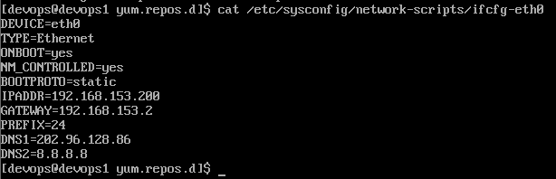
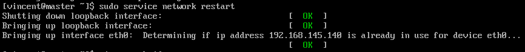
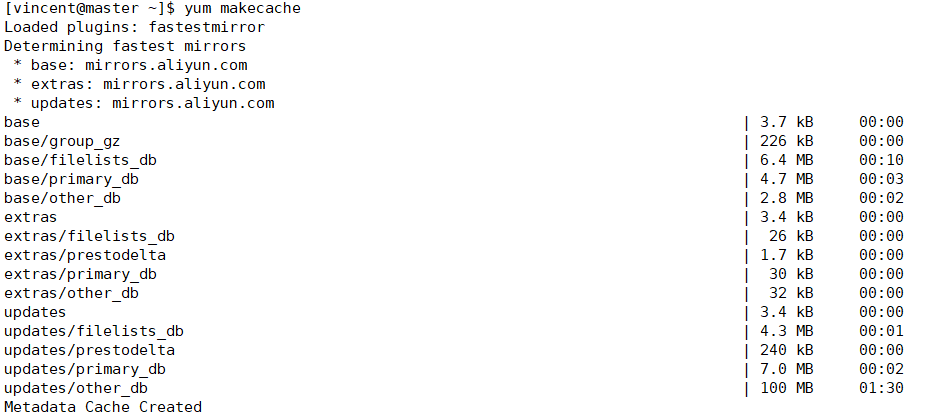

# 工具链搭建（一） #
## 安装CentOS 6.9 minimal 后的基本配置 ##
### 1. root登陆后添加新用户 ###
```
[root@master ~]# useradd vincent //添加新用户vincent
[root@master ~]# passwd vincent //设置vincent密码
[root@master ~]# visudo //将vincent添加到sudors

如果要设置sudo免密码，格式如下： 用户名 ALL=(ALL)  NOPASSWD:  ALL
```
>visudo中更改如下图  
>  
>保存并退出
>然后终端输入exit退出登陆，改用用户vincent登陆

### 2. 网络配置，设置固定ip ###
默认情况下时上不了网的，因为还没有配置网络。
```
[vincent@master ~]$ sudo vi /etc/sysconfig/network-scripts/ifcfg-eth0
```
>将ifcfg-eth0更改为  
  
>其中关键是设置IPADDR、GATEWAY、PREFIX、DNS1、DNS2，另外将ONBOOT设置为yes可以自启动，BOOTPROTO设为static不用dhcp来自动获取ip

然后重启network服务
```
[vincent@master ~]$ sudo service network restart
```
重启成功效果如下图  



### 3. 配置阿里源 ###
包括官方源和epel源  
安装epel源
```
[vincent@master ~]$ sudo yum install epel-release
```
备份repo文件
```
[vincent@master ~]$ sudo mv /etc/yum.repos.d/CentOS-Base.repo /etc/yum.repos.d/CentOS-Base.repo.backup
[vincent@master ~]$ sudo mv /etc/yum.repos.d/epel.repo /etc/yum.repos.d/epel.repo.backup
[vincent@master ~]$ sudo mv /etc/yum.repos.d/epel-testing.repo /etc/yum.repos.d/epel-testing.repo.backup
```
然后下载并替换repo配置文件
```
[vincent@master ~]$ sudo wget -O /etc/yum.repos.d/epel.repo http://mirrors.aliyun.com/repo/epel-6.repo
```
生成缓存
```
[vincent@master ~]$ sudo yum clean all && yum makecache
```
效果如下  
  
建议最后更新一下系统
```
[vincent@master ~]$ sudo yum -y update
```
### 4. 安装JDK8  ###
使用官方的rpm安装方式方便快捷且易于维护  
首先下载JDK
```
[vincent@master ~]$ sudo yum  install -y wget    //安装下载工具wget
[vincent@master ~]$ wget --no-cookie --header "Cookie: oraclelicense=accept-securebackup-cookie" http://download.oracle.com/otn-pub/java/jdk/8u161-b12/2f38c3b165be4555a1fa6e98c45e0808/jdk-8u161-linux-x64.rpm //接受协议并下载java 1.8.161
```
安装JDK
```
[vincent@master ~]$ sudo rpm -ivh jdk-8u161-linux-x64.rpm
```
  

使用alternatives配置JAVA环境  
配置java
```
[vincent@master ~]$ sudo alternatives --config java
```
   

配置javac
```
[vincent@master ~]$ sudo alternatives --config javac
```
   

>使用这种方法安装的好处是当有多个java版本时可以很方便地选取我们需要的版本。

### 5. SSH基本配置 ###
生成ssh私钥和公钥  
```
[vincent@master ~]$ ssh-keygen -t rsa
```
  
相关文件生成在.ssh中  
>两台电脑免密登陆方法：[ssh免密码登录配置方法，（图示加命令）](http://blog.csdn.net/universe_hao/article/details/52296811)

### 6.开放端口 ###
CentOS 6使用iptables管理端口  
开放端口的方法有很多，下面以开放8080端口为例
>1. 直接修改 /etc/sysconfig/iptables
```
[vincent@master ~]$ sudo vi /etc/sysconfig/iptables
```
>  
>可以直接参照默认开启的22号端口的写法，开放8080端口  
>:wq保存退出后重启防火墙
>```
>[vincent@master ~]$ sudo service iptables restart
>```

>2. 直接使用iptables命令（经验证会失效？？）
>```
>[vincent@master ~]$ iptables -A INPUT -p tcp --dport 8080 -j ACCEPT
>```
>然后保存并重启
>```
>[vincent@master ~]$ sudo service iptables save && sudo service iptables restart
>```

更多可参照[iptables的详细用法](http://blog.csdn.net/yejinxiong001/article/details/53610028)