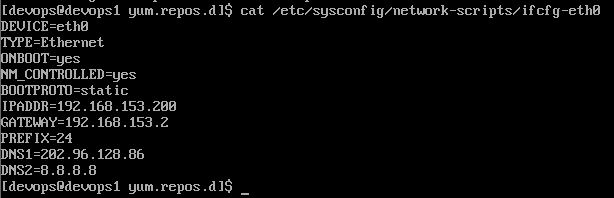
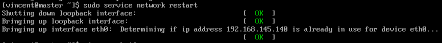
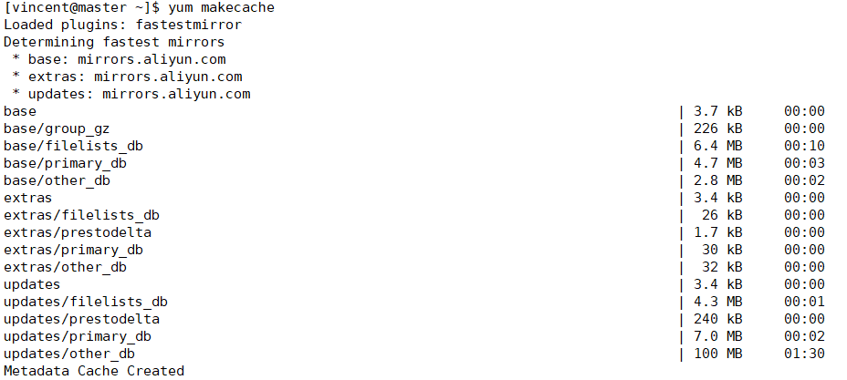
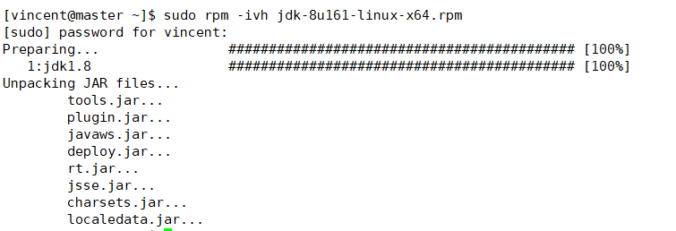
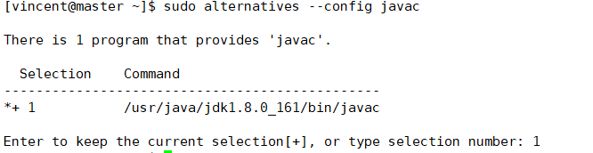
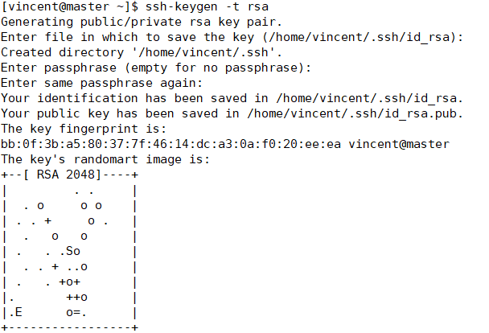
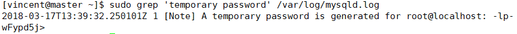
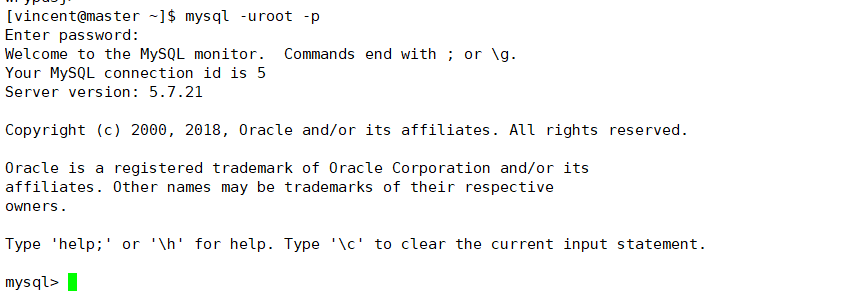

# 工具链搭建（一） #
## 安装CentOS 6.9 minimal 后的基本配置 ##
### 1. root登陆后添加新用户 ###
```
[root@master ~]# useradd vincent //添加新用户vincent
[root@master ~]# passwd vincent //设置vincent密码
[root@master ~]# visudo //将vincent添加到sudors
```
>visudo中更改如下图  
>  
>保存并退出
>然后终端输入exit退出登陆，改用用户vincent登陆

### 2. 网络配置，设置固定ip ###
默认情况下时上不了网的，因为还没有配置网络。
```
[vincent@master ~]$ sudo vi /etc/sysconfig/network-scripts/ifcfg-eth0
```
>将ifcfg-eth0更改为  
  
>其中关键是设置IPADDR、GATEWAY、PREFIX、DNS1、DNS2，另外将ONBOOT设置为yes可以自启动，BOOTPROTO设为none不用dhcp来自动获取ip

然后重启network服务
```
[vincent@master ~]$ sudo service network restart
```
重启成功效果如下图  



### 3. 配置阿里源 ###
首先备份repo文件
```
[vincent@master ~]$ sudo mv /etc/yum.repos.d/CentOS-Base.repo /etc/yum.repos.d/CentOS-Base.repo.backup
```
然后下载并替换repo配置文件
```
[vincent@master ~]$ sudo curl -o /etc/yum.repos.d/CentOS-Base.repo http://mirrors.aliyun.com/repo/Centos-6.repo
```
生成缓存
```
[vincent@master ~]$ yum makecache
```
效果如下  
  
建议最后更新一下系统
```
[vincent@master ~]$ sudo yum -y update
```
### 4. 安装JDK8  ###
使用官方的rpm安装方式方便快捷且易于维护  
首先下载JDK
```
[vincent@master ~]$ sudo yum  install -y wget    //安装下载工具wget
[vincent@master ~]$ wget --no-cookie --header "Cookie: oraclelicense=accept-securebackup-cookie" http://download.oracle.com/otn-pub/java/jdk/8u161-b12/2f38c3b165be4555a1fa6e98c45e0808/jdk-8u161-linux-x64.rpm //接受协议并下载java 1.8.161
```
安装JDK
```
[vincent@master ~]$ sudo rpm -ivh jdk-8u161-linux-x64.rpm
```
  

使用alternatives配置JAVA环境  
配置java
```
[vincent@master ~]$ sudo alternatives --config java
```
   

配置javac
```
[vincent@master ~]$ sudo alternatives --config javac
```
   

>使用这种方法安装的好处是当有多个java版本时可以很方便地选取我们需要的版本。

### 5. SSH基本配置 ###
生成ssh私钥和公钥  
```
[vincent@master ~]$ ssh-keygen -t rsa
```
  
相关文件生成在.ssh中  
>两台电脑免密登陆方法：[ssh免密码登录配置方法，（图示加命令）](http://blog.csdn.net/universe_hao/article/details/52296811)

### 6. 安装MySql  ###
首先从官网下载rpm包
```
[vincent@master ~]$ wget https://repo.mysql.com//mysql57-community-release-el6-11.noarch.rpm
```
添加MySQL源
```
[vincent@master ~]$ sudo rpm -ivh mysql57-community-release-el6-11.noarch.rpm 

也可以

[vincent@master ~]$ sudo yum localinstall mysql57-community-release-el6-11.noarch.rpm 
```
生成yum缓存
```
[vincent@master ~]$ yum makecache
```
安装MySQL
```
[vincent@master ~]$ sudo yum install -y mysql mysql-server
```
启动MySQL服务
```
[vincent@master ~]$ sudo service mysqld start
```
设置mysqld服务自启动
```
[vincent@master ~]$ sudo chkconfig mysqld on
```
至此，MySQL已经安装好了。  
默认情况下，系统会创建一个root用户。我们需要获得root的临时密码。
```
[vincent@master ~]$ sudo grep 'temporary password' /var/log/mysqld.log
```
  
接着，利用获得的临时密码登陆MySQL。
```
[vincent@master ~]$ mysql -uroot -p
```
  
更改root用户密码
```
mysql> ALTER USER 'root'@'localhost' IDENTIFIED BY '123456Asd!';
```
>注意密码要稍微复杂点，不然会因为不合要求而设置失败。

添加新用户test
```
mysql> create user 'test'@'%' identified by '123456Asd!';
```
刷新权限
```
mysql> flush privileges;

```
输入exit退出MySQL shell。
