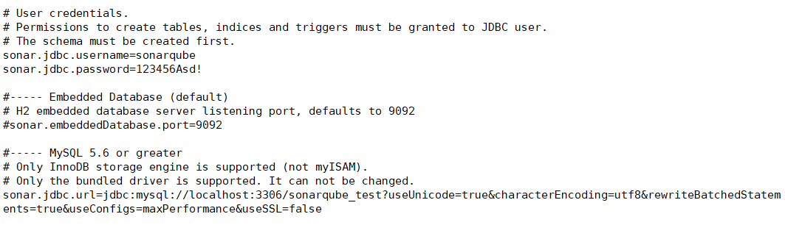
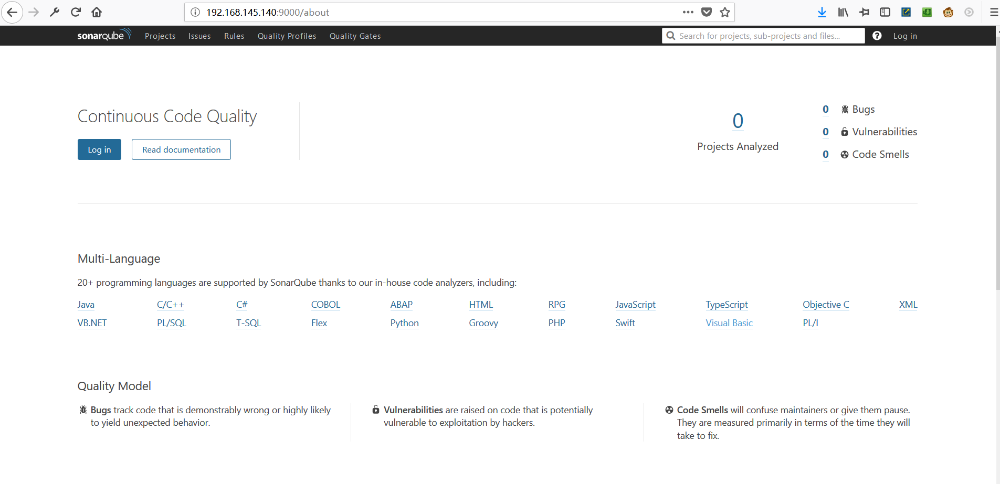

# Install SonarQube #
## 安装SonarQube ##
1. 下载SonarQube  
最新的LTS版本6.7.2。[点击查看支持和依赖](https://docs.sonarqube.org/display/SONARQUBE67/Requirements)
```
[vincent@master ~]$ wget https://sonarsource.bintray.com/Distribution/sonarqube/sonarqube-6.7.2.zip
```
2. 解压  
要先安装unzip
```
[vincent@master ~]$ sudo yum install -y unzip
```
使用unzip解压.zip文件，并重命名
```
[vincent@master ~]$ unzip sonarqube-6.7.2.zip 
[vincent@master ~]$ mv sonarqube-6.7.2 sonarqube
```
<!-- 3. 更改sonarqube文件权限和所属用户组
```
[vincent@master ~]$ cd /opt/
[vincent@master opt]$ sudo chown -R vincent:vincent sonarqube-6.7.2
``` -->
3. 启动SonarQube
```
[vincent@master ~]$ ./sonarqube/bin/linux-x86-64/sonar.sh console
```
或
```
[vincent@master ~]$ ./sonarqube/bin/linux-x86-64/sonar.sh start
```
4. 开启9000端口
注意要开启SonarQube的运行端口9000
>```
>[vincent@master ~]$ iptables -A INPUT -p tcp --dport 8000 -j ACCEPT
>```
>然后保存并重启
>```
>[vincent@master ~]$ sudo service iptables save && sudo service iptables restart
>```
5. 为SonarQube创建MySQL账户和数据库  
>使用root用户登陆MySQL,然后
```
mysql> create user 'sonarqube'@'%' identified by '123456Asd!';
mysql> create database sonarqube-test;
mysql> grant all privileges on sonarqube_test.* to 'sonarqube';

```
6. 配置SonarQube
打开sonarqube/conf/sonar.properties
```
[vincent@master ~]$ vi sonarqube/conf/sonar.properties
```
修改如下内容  
```
sonar.jdbc.username=sonarqube
sonar.jdbc.password=123456Asd!

sonar.jdbc.url=jdbc:mysql://localhost:3306/sonarqube_test?useUnicode=true&characterEncoding=utf8&rewriteBatchedStatements=true&useConfigs=maxPerformance&useSSL=false
```

分别是MySQL的用户名(sonarqube)，密码(123456Asd!)以及数据库(sonarqube_test)。配置文件中很多东西只要把作为注释的“#”去掉并稍作修改即可。还可以配置很多其他的，比如说运行的端口。[详情见参考](https://devopscube.com/setup-and-configure-sonarqube-on-linux/)
7. 重启SonarQube
```
[vincent@master ~]$ ./sonarqube/bin/linux-x86-64/sonar.sh restart
```
打开浏览器，输入http://(ip地址):9000即可使用SonarQube。 
默认用户名：admin 密码：admin   

8. 将sonarqube设置为服务  
[详情见参考](https://devopscube.com/setup-and-configure-sonarqube-on-linux/)


### 待解决问题 ###
>将sonarqube放在/opt目录下使用sudo(或者root用户)来运行sonarqube会失败。