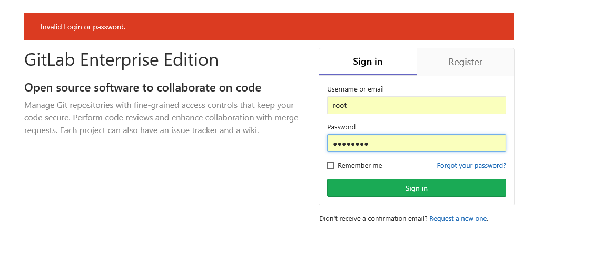

# gitlab的安装 #
以下的教程来源于gitlab官网[点击查看](https://about.gitlab.com/installation/#centos-6)

一、安装并配置必要的依赖关系

1.在CentOS 6（和RedHat / Oracle / Scientific Linux 6）上，以下命令还将打开系统防火墙中的HTTP和SSH访问。
```
sudo yum install -y curl policycoreutils-python openssh-server cronie
sudo lokkit -s http -s ssh
```
2.接下来，安装Postfix发送通知邮件。 如果您想使用其他解决方案发送电子邮件，请跳过此步骤并在安装GitLab后配置外部SMTP服务器。
```
sudo yum install postfix
sudo service postfix start
sudo chkconfig postfix on
```
在Postfix安装期间，可能会出现一个配置屏幕。 选择“Internet站点”并按回车。 使用您的服务器的外部DNS作为'邮件名'并按回车。 如果出现其他屏幕，请继续按回车键以接受默认值.

二、添加GitLab软件包存储库并安装软件包

1.添加GitLab软件包存储库。
```
curl https://packages.gitlab.com/install/repositories/gitlab/gitlab-ee/script.rpm.sh | sudo bash
```
2.接下来，安装GitLab软件包。 将`http：// gitlab.example.com`更改为您想要访问您的GitLab实例的URL。 安装将自动在该URL处配置并启动GitLab。 安装后HTTPS需要额外的配置
```
sudo EXTERNAL_URL="http://gitlab.example.com" yum -y install gitlab-ee
```

初始化gitlab
```
gitlab-ctl reconfigure
```
查看服务
```
gitlab-ctl status
```
重启、停止或启动服务
```
gitlab-ctl restart/stop/start
```
配置文件目录
```
/etc/gitlab/gitlab.rb
```
三、浏览到主机名并登录

1.第一次访问时，您将被重定向到密码重置屏幕。 为初始管理员帐户提供密码，您将被重定向回登录屏幕。 使用默认帐户的用户名root登录。


这里我的centos的ip地址为：192.168.222.151  访问的时候用这个访问
```
重置之后我的密码为12345678,
```
四、设置您的通信首选项

访问我们的电子邮件订阅偏好中心，让我们知道何时与您沟通。 我们有明确的电子邮件选择政策，因此您可以完全控制我们向您发送电子邮件的频率和频率。

每月两次，我们发送您需要了解的GitLab新闻，包括新功能，集成，文档以及我们开发团队的幕后故事。 对于与错误和系统性能有关的重要安全更新，请注册我们的专用安全通讯。


特别注意：这里gitlab默认的访问端口为80，和nginx的默认访问端口冲突，因此需要修改一下gitlab的默认访问端口，修改步骤如下：

1.修改/etc/gitlab/gitlab.rbz这个配置文件
```
vim /etc/gitlab/gitlab.rb

#unicorn['port'] = 8080 修改 8010  默认是注释的去掉前面的#
unicorn['port'] = 8010
#nginx['listen_port'] = nil 修改 8020  默认是注释的去掉前面的#
nginx['listen_port'] = 8020
```
2.修改/var/opt/gitlab/gitlab-rails/etc/unicorn.rb
```
vim /var/opt/gitlab/gitlab-rails/etc/unicorn.rb

#listen "127.0.0.1:8080", :tcp_nopush => true
listen "127.0.0.1:8010", :tcp_nopush => true
```

3.修改默认的gitlab nginx的web服务80端 /var/opt/gitlab/nginx/conf/gitlab-http.conf
```
vim /var/opt/gitlab/nginx/conf/gitlab-http.conf

#listen *:80;
listen *:8020;
```
4.重新配置gitlab
```
gitlab-ctl reconfigure
```
5.重新启动gitlab
```
gitlab-ctl restart
```

**这里你的新端口一定要对外开放


在运行过程中