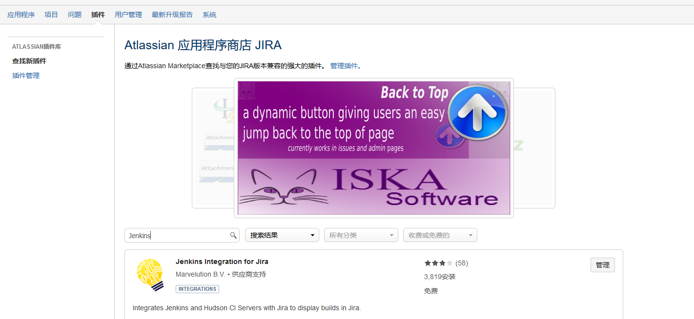
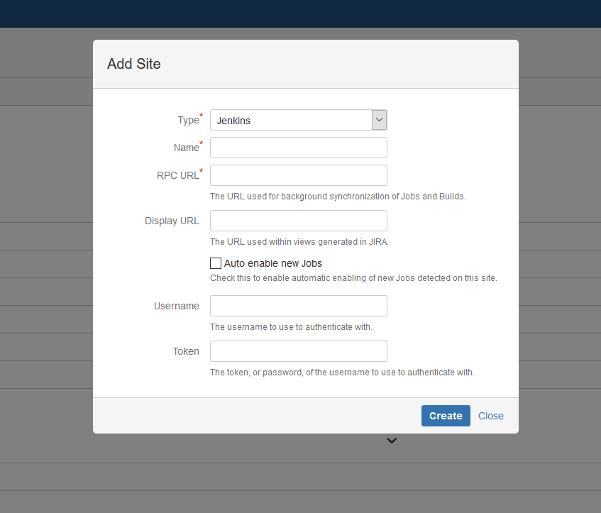
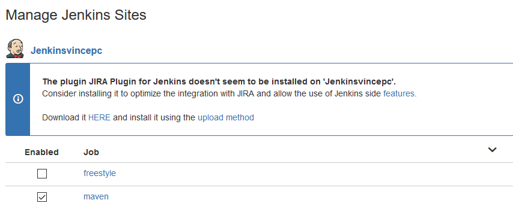
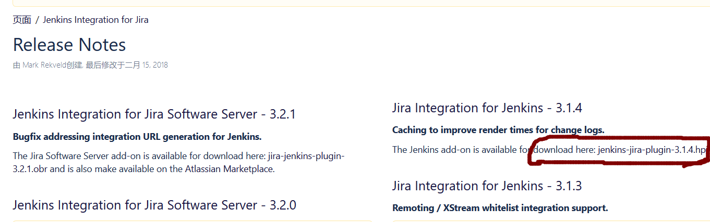
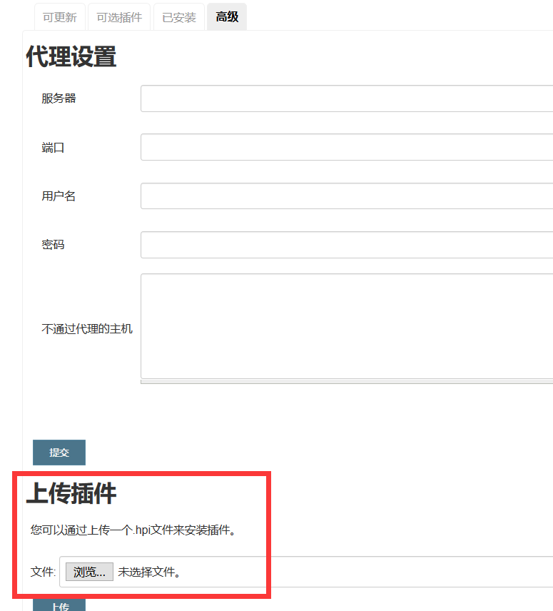
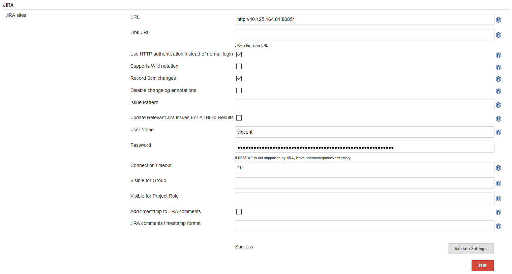
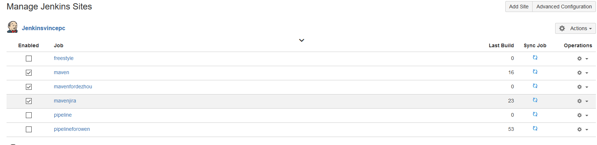
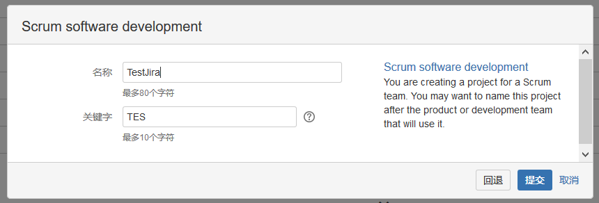
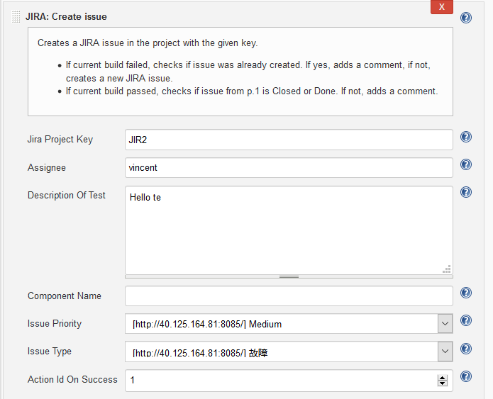
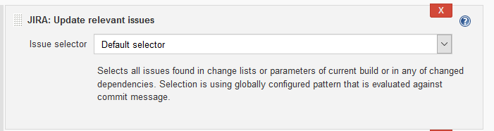

# Jenkins集成Jira #
## 1. 准备工作 ##
* Jira端  
    打开Jira，基本配置做好之后，进入主页，点击右上角设置图标，选择“应用程序”，进入后，点击“插件”，搜索jenkins，安装“Jenkins Integration for jira”  
      
    点击“应用程序”，选择“Jenkins configuration”->“Add Site”，输入Jenkins相关信息，“Display”不用填，“Token”填用户密码即可。
      
    设置好后，Jira就可以连接Jenkins了。但是可能会有警告  
     
    点击“HERE”  
      
    下载相应的插件。下面配置Jenkins。

* Jenkins端  
    进入Jenkins插件管理，搜索Jira相关插件，根据需要选择安装（“Jira plugin”必装），在这里，我装了Jira Issue Updater、Jira Issue Updater、JIRA Trigger Plugin和JiraTestResultReporter plugin。进入“高级”选项，上传刚刚在配置Jira端下载的插件JIRA Integration for Jenkins。 
       
    在Jenkins的“系统管理”->“系统设置”里，填写Jira相关配置。   
      
    点“Validate Settings”可查看Jenkins是否连上Jira。
## Jenkins与Jira集成  ##
在Jira端，将相应的工程的checkbox框打上。
  
点击左上角“项目”->“创建项目”,项目创建过程中会生成一个JIRA KEY。  
  
>1. Jenkins中Maven项目的配置，在“构建后操作”中添加“JIRA:Create issue”。注意“Jira Project Key”要用自己上面生成的(不是JIR2)。  
>      
>    经过以上设置，当Maven项目Build失败后，就会在Jira中创建一个新的issue。  

>2. 在“构建后操作”中添加“JIRA:Update relevant issues”  
>     
>   再配合前面的触发器设置当SCM进行push时build。当用户commit时添加的comment为“\<JIRA KEY\>-\<number\> \<comment\>”格式时（如“JIR-3 add Jenkins file”,JIR时JIRA KEY，3是number，add Jenkins file是comment），会自动建立issue。