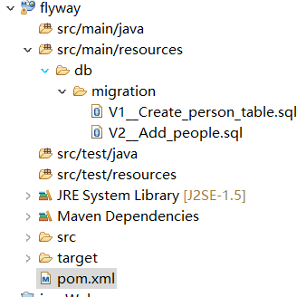
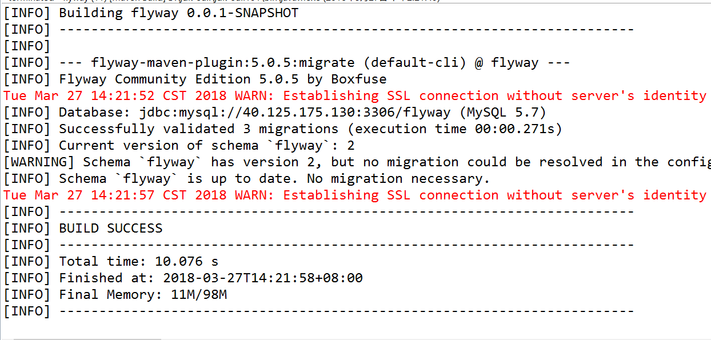
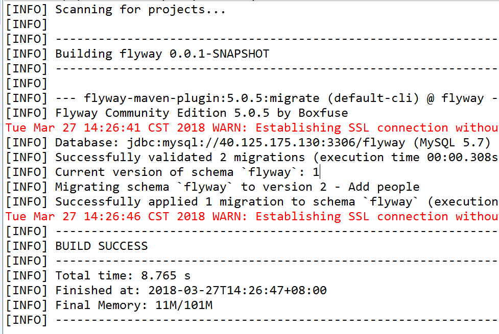
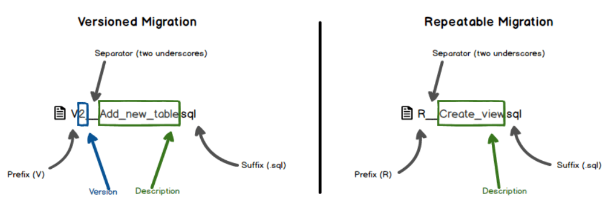

# flyway在maven中的简单使用 #

一.flyway的简介
  
  Flyway 是独立于数据库的应用、管理并跟踪数据库变更的数据库版本管理工具。
简单的说他就是一个数据库版本控制工具。

二.flyway配合maven的使用
1.新建一个maven工程，并在在 resources 目录下建立 db/migration 目录。如下图：


2.添加 Flyway 插件，并配置 mysql 的 连接字符串 、 用户名 和 密码 ：
```
<build>
  <plugins>
    <plugin>
      <groupId>org.flywaydb</groupId>
      <artifactId>flyway-maven-plugin</artifactId>
      <version>5.0.5</version>
      <configuration>
        <url>jdbc:mysql://hostname:port#/db_name</url>
        <user>username</user>
        <password>password</password>
      </configuration>
    </plugin>
  </plugins>
</build>
```
还要加上mysql 的驱动的依赖
```
<!-- https://mvnrepository.com/artifact/mysql/mysql-connector-java -->
<dependency>
    <groupId>mysql</groupId>
    <artifactId>mysql-connector-java</artifactId>
    <version>5.1.41</version>
</dependency>
```
3.迁移数据库

（1）建立一个 空 数据库用于测试。
（2）在 db/migration 目录下建立 SQL 脚本 V1__Create_person_table.sql 
```
create table PERSON (
    ID int not null,
    NAME varchar(100) not null
);
```
（3）运行 maven 命令： mvn flyway:migrate ，数据库中会建立表 flyway_schema_history 跟踪数据库版本，插入第一次迁移记录，并执行 SQL 脚本。

4、第二次迁移

（1）在 db/migration 目录下建立 SQL 脚本 V2__Add_people.sql ：
```
insert into PERSON (ID, NAME) values (1, 'Axel');
insert into PERSON (ID, NAME) values (2, 'Mr. Foo');
insert into PERSON (ID, NAME) values (3, 'Ms. Bar');
```
（2）运行 maven 命令： mvn flyway:migrate ， flyway_schema_histry 会插入第二条记录，并执行 SQL 脚本：


三、命令
1、Flyway 迁移

（1）带版本的迁移：迁移脚本带版本号，每一次带版本的迁移都有 版本号 、 描述 和 校验和 ，并且只能执行 一次 。典型用于数据表结构变更等。
（2）可重复的迁移：和带版本的迁移不同，它没有版本号，只有 描述 和 校验和 ，而且可以 多次 执行。典型用于插入数据等操作。
（3）脚本命名规则：


2、Flyway 命令

migrate：把数据库迁移到最新版本，迁移是根据 db/migration 目录下的脚本 顺序 执行。

clean： 清空 数据库中的数据， 不能在生产环境使用此命令 。

info：打印出版本迁移信息。

validate：验证要执行的迁移脚本。

baseline：为已经存在的数据库建立基线，迁移数据库将建立在基线的基础上。

repair：修复 flyway_schema_histry 表。


给数据库加上权限
 GRANT ALL PRIVILEGES ON flyway.* TO 'test'@'%';