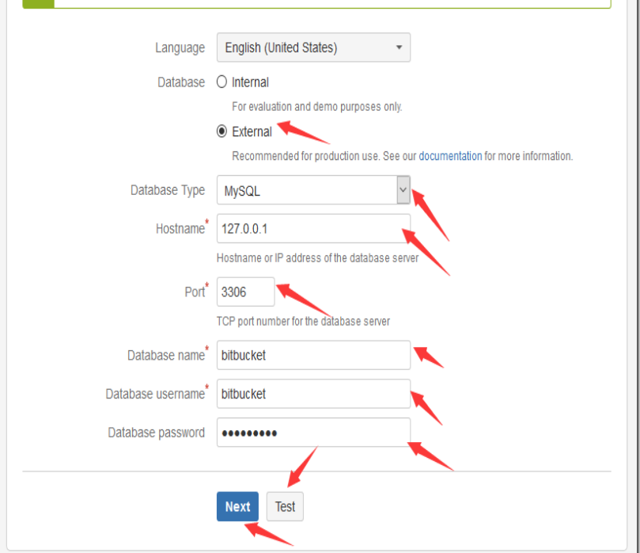
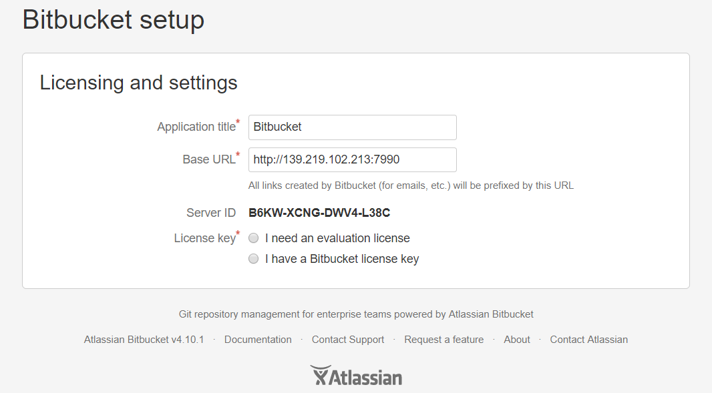
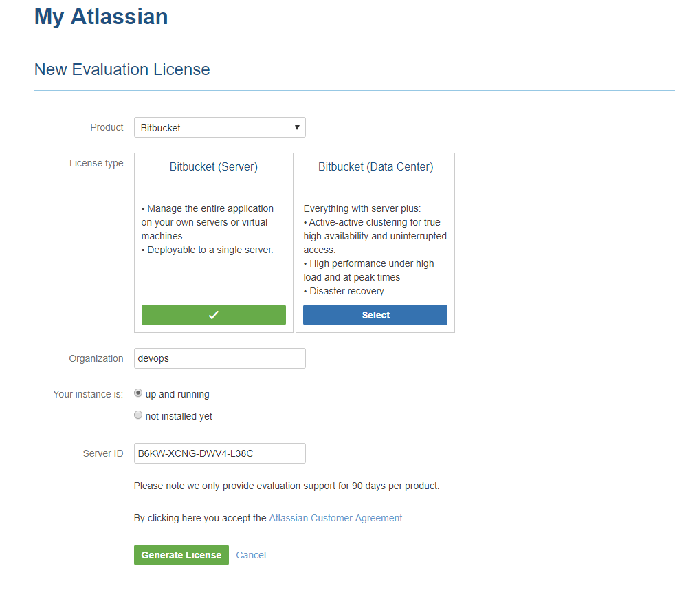
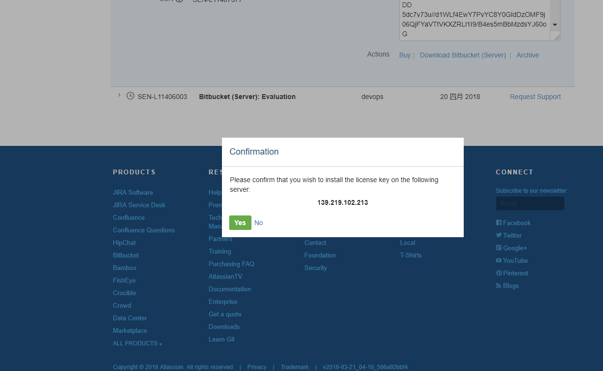
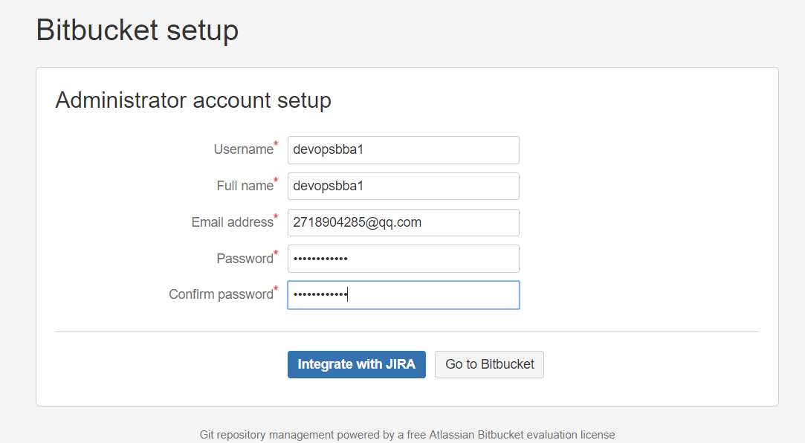

# bitbucket 的安装过程 # 

一.下载以及修改权限
```
sudo wget https://downloads.atlassian.com/software/stash/downloads/atlassian-bitbucket-4.10.1-x64.bin

chmod +x atlassian-bitbucket-4.10.1-x64.bin

./atlassian-bitbucket-4.10.1-x64.bin
```

执行上面的步骤以后，会出现bitbucket的安装交互界面，按照提示就行安装即可。

二.安装成功以后，在浏览器输入 ：139.219.102.213:7990 进入下面的界面：

说明服务器上面的git版本过低，因此需要升级git的版本。

升级git的方法，这里采用的是先卸载原有的版本，然后在安装升级后的版本。具体步骤如下；
```
1.安装编译git时需要的包
sudo yum install curl-devel expat-devel gettext-devel openssl-devel zlib-devel
sudo yum install  gcc perl-ExtUtils-MakeMaker

2.删除已有的git
sudo yum remove git

3.下载git源码

sudo wget https://www.kernel.org/pub/software/scm/git/git-2.0.5.tar.gz
 tar xzf git-2.0.5.tar.gz

 4.编译安装
# cd git-2.0.5
# sudo make prefix=/usr/local/git all
# sudo make prefix=/usr/local/git install
# sudo echo "export PATH=$PATH:/usr/local/git/bin" >> /etc/bashrc

执行这一步如果不成功，-bash: /etc/bashrc: Permission denied,
则需要切换为root用户然后执行
（如果root密码输错，则用 sudo passwd root  设置root的秘密）

# source /etc/bashrc

5.检查一下版本号
# git --version

git version 2.0.5
```
三.接下来下载mysql的驱动
```
sudo wget https://dev.mysql.com/get/Downloads/Connector-J/mysql-connector-java-5.1.45.tar.gz
tar zxvf mysql-connector-java-5.1.45.tar.gz

cd mysql-connector-java-5.1.45
cp mysql-connector-java-5.1.45-bin.jar /home/devopsbba1/atlassian/bitbucket/4.10.1/lib/

```

四.重新访问139.219.102.213:7990,依然显示git版本过低，需要重新启动bitbucket,然后出现如下的情况。

 这个过程需要加载一些东西，需要等待一会  


五.接下来在mysql上创建bitbucket数据库和账户。
```
mysql -uroot -p

mysql> CREATE DATABASE bitbucket CHARACTER SET utf8 COLLATE utf8_bin;
mysql> GRANT ALL PRIVILEGES ON bitbucket.* TO 'bitbucketuser'@'localhost' IDENTIFIED BY '123456Asd!';
mysql> FLUSH PRIVILEGES;
mysql> QUIT

特别注意：如果你的bitbucket服务器与mysql的服务器不在同一个，则需要把上面的localhost改为bitbucket所在的ip地址。还有就是就创建数据库的时候，字符集为utf-8，不然后test不成功
```
重启bitbucket
```
 cd atlassian/bitbucket/4.10.1/bin   
 ./startup.sh
```
六.重新进入bitbucket







以上bitbucket安装过程参考[点击查看](http://www.bubuko.com/infodetail-1825280.html)
git的升级过程参考[点击查看](http://blog.sina.com.cn/s/blog_3fe961ae0102w9ui.html)

mysql数据库的配置信息参考[点击查看](https://confluence.atlassian.com/bitbucketserver/connecting-bitbucket-server-to-mysql-776640382.html)