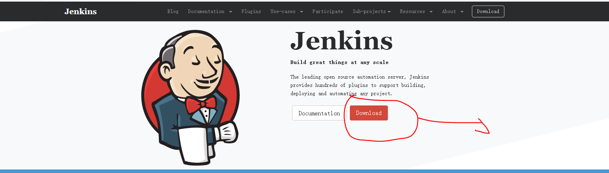
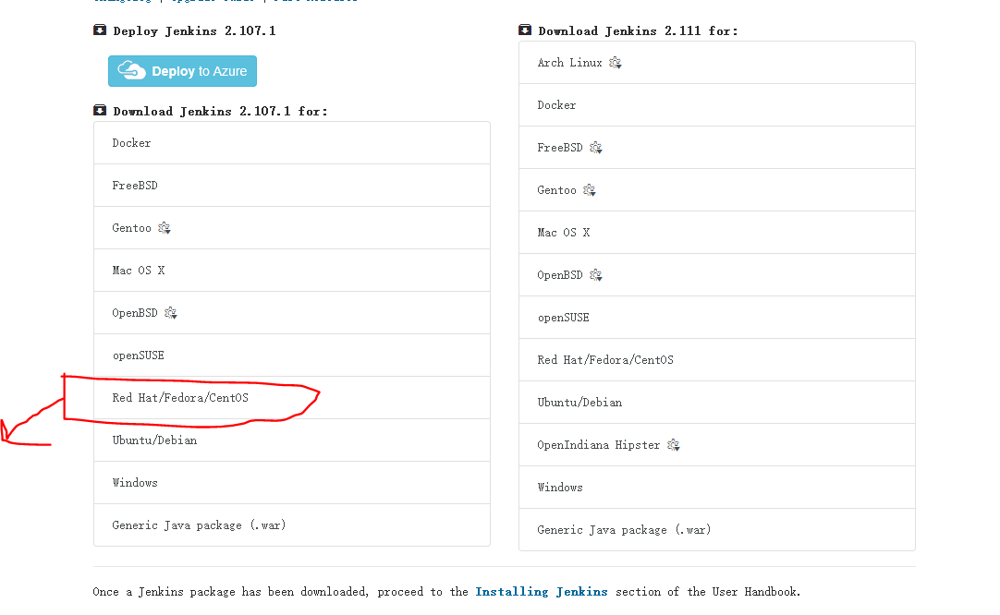
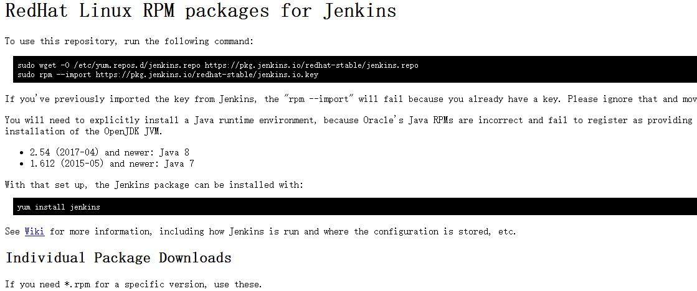
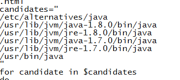

# jenkins的安装 #

一、进入jenkins的官网如下图所示


点击Download然后跳转到下面的页面，选择centos的链接


跳转到下面的页面：


安装图中的步骤安装jenkins
```
sudo wget -O /etc/yum.repos.d/jenkins.repo https://pkg.jenkins.io/redhat-stable/jenkins.repo
sudo rpm --import https://pkg.jenkins.io/redhat-stable/jenkins.io.key

yum install jenkins
此步骤为上图中的代码
```

二、检查jenkins是否配置jdk，在candidates后面加上自己的jdk路径，如下：
```
vi /etc/rc.d/init.d/jenkins
```


这里我安装jdk的路径为默认的，jenkins已经默认配置了，需要注意的是如果你在安装jdk时在上图中的路径没有，需要自己加上。

三、启动jenkins

```
java -jar /usr/lib/jenkis/jenkins.war  --httpPort='端口号'

用上面的安装方法，目录默认是这里，注意后面要加上端口号，避免和其他端口冲突
```
这里需要注意一点，不要忘记在 /etc/hosts这个配置文件中加上你的主机名    127.0.0.1   master （这里master是我的主机名）

这里还要注意的是centos必须对外开放一些端口，否则远程访问不到，以下是开放端口的语句
```
直接修改配置文件的方法如下：
sudo vi /etc/sysconfig/iptables

-A INPUT -m state --state RELATED,ESTABLISHED -j ACCEPT
-A INPUT -p icmp -j ACCEPT
-A INPUT -i lo -j ACCEPT
-A INPUT -p tcp -m state --state NEW -m tcp --dport 22 -j ACCEPT
-A INPUT -p tcp -m state --state NEW -m tcp --dport 80 -j ACCEPT
-A INPUT -p tcp -m state --state NEW -m tcp --dport 9550 -j ACCEPT
-A INPUT -p tcp -m state --state NEW -m tcp --dport 8080 -j ACCEPT
-A INPUT -p tcp -m state --state NEW -m tcp --dport 5050 -j ACCEPT
-A INPUT -p tcp -m state --state NEW -m tcp --dport 5005 -j ACCEPT
-A INPUT -p tcp -m state --state NEW -m tcp --dport 8070 -j ACCEPT
-A INPUT -p tcp -m state --state NEW -m tcp --dport 8090 -j ACCEPT
-A INPUT -p tcp -m state --state NEW -m tcp --dport 6006 -j ACCEPT

sudo service iptables restart

第二种方式用语句来修改
iptables -A INPUT -p tcp --dport 8080 -j ACCEPT
然后保存并重新启动
sudo service iptables save && sudo service iptables restart
再通过查看哪些端口已经对外开放
/etc/init.d/iptables status
```


在浏览器输入  http://192.168.222.151:9550 来访问如下图所示：


输入密码点击登录以后