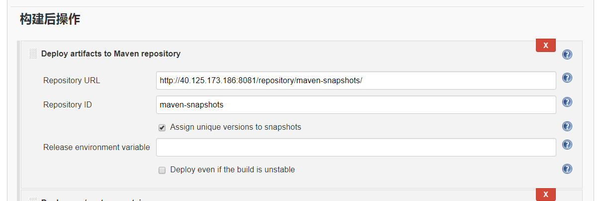

# jenkins项目传到nexus的配置方法 #
1.需要在项目的pom.xml这个配置文件中加入nexus的仓库信息。
```
<distributionManagement>  
        <repository>  
            <id>maven-releases</id>  
            <name>maven-releases</name>  
            <url>http://40.125.173.186:8081/repository/maven-releases/</url>  
        </repository>  
        <snapshotRepository>
            <id>maven-snapshots</id>
            <url>http://40.125.173.186:8081/repository/maven-snapshots/</url>
        </snapshotRepository>
</distributionManagement>
上面的仓库信息为自己nexus上的信息
```
   特别注意，上面的配置只是针对的需要上传的项目，并没有进行全局配置。
2.在setting.xml配置文件中加入仓库的信息。
```
<servers>
    <server>
        <id>nexus</id>
        <username>admin</username>
        <password>admin123</password>
    </server>
</servers>
```
3.在jenkins中加入以下的配置信息。

