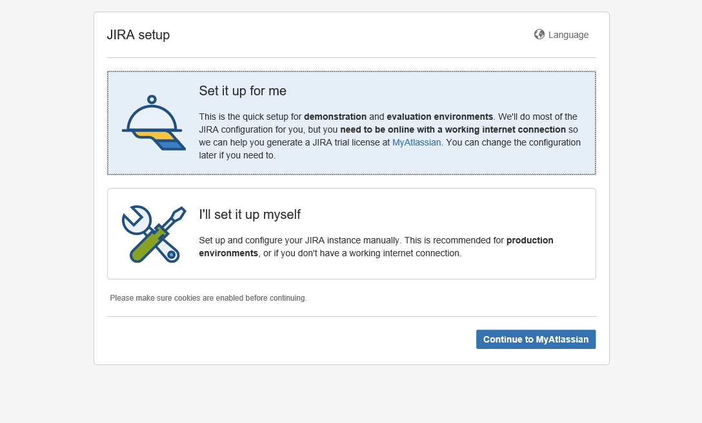

# JIRA的安装过程详解 #
一、安装JIRA7.6.0
1.下载并解压jira到/tmp目录
```
wget -c -P /tmp https://downloads.atlassian.com/software/jira/downloads/atlassian-jira-software-7.6.0.tar.gz
cd /tmp
tar zxvf atlassian-jira-software-7.6.0.tar.gz
cp -rv atlassian-jira-software-7.6.0-standalone/ /opt/
```
2.创建软链接，注意jira目录后不要带“/”，/opt/jira就作为jira的安装目录
```
ln -sv /opt/atlassian-jira-software-7.6.0-standalone /opt/jira
```
3.创建jira用户并设置密码为”123456“
```
/usr/sbin/useradd --create-home --comment "JIRA Software" --shell /bin/bash jira
echo "123456" | passwd --stdin jira
```
4.设置jira目录只允许jira用户访问
```
chown -R jira.jira /opt/jira/
chmod -R 700 /opt/jira/
```
5.创建jira家目录，用于log、搜索索引等文件的存储，并限制只允许jira用户访问
```
mkdir /home/jira/jirasoftware-home
chown -R jira.jira /home/jira/jirasoftware-home
chmod -R 700 /home/jira/jirasoftware-home
```
6.设置/opt/jira/atlassian-jira/WEB-INF/classes/jira-application.properties文件，在末尾去除注释并修改为上面设置的jira家目录路径
```
jira.home=/home/jira/jirasoftware-home
```
7.配置家目录的环境变量
```
echo 'JIRA_HOME=/home/jira/jirasoftware-home' >> /etc/profile
echo 'export JIRA_HOME' >> /etc/profile
source /etc/profile
```
8.检查端口是否被占用，jira默认运行的端口有8005和8080，Server port (8005) and the Connector port (8080) ，如果被占用，可打开/opt/jira/conf/server.xml文件修改端口，如果防火墙打开，则放行修改后的端口，下面的例子是修改成5005和5050
```
<Server port="5005" shutdown="SHUTDOWN">
…
<Service name="Catalina">
<Connector port="5050"
maxThreads="150"
minSpareThreads="25"
connectionTimeout="20000"
enableLookups="false"
maxHttpHeaderSize="8192"
protocol="HTTP/1.1"
useBodyEncodingForURI="true"
redirectPort="8443"
acceptCount="100"
disableUploadTimeout="true"/>
```
9.下载mysql数据库连接jar包并拷贝到jira的lib目录下
```
wget -c -P /tmp wget https://dev.mysql.com/get/Downloads/Connector-J/mysql-connector-java-5.1.45.tar.gz
cd /tmp
tar zxvf mysql-connector-java-5.1.45.tar.gz
cd mysql-connector-java-5.1.45
cp mysql-connector-java-5.1.45-bin.jar /opt/jira/lib/
```
10.可以切换到jira帐号下启动jira并查看8080端口，可以将启动命令放在/etc/rc.local文件中
```
[root@master zhoudechao]# /bin/sh /opt/jira/bin/start-jira.sh

To run JIRA in the foreground, start the server with start-jira.sh -fg
executing as current user
                .....
          .... .NMMMD.  ...
        .8MMM.  $MMN,..~MMMO.
        .?MMM.         .MMM?.

     OMMMMZ.           .,NMMMN~
     .IMMMMMM. .NMMMN. .MMMMMN,
       ,MMMMMM$..3MD..ZMMMMMM.
        =NMMMMMM,. .,MMMMMMD.
         .MMMMMMMM8MMMMMMM,
           .ONMMMMMMMMMMZ.
             ,NMMMMMMM8.
            .:,.$MMMMMMM
          .IMMMM..NMMMMMD.
         .8MMMMM:  :NMMMMN.
         .MMMMMM.   .MMMMM~.
         .MMMMMN    .MMMMM?.

      Atlassian JIRA
      Version : 7.6.0
                  

If you encounter issues starting or stopping JIRA, please see the Troubleshooting guide at http://confluence.atlassian.com/display/JIRA/Installation+Troubleshooting+Guide

Using JIRA_HOME:       /home/jira/jirasoftware-home

Server startup logs are located in /opt/jira/logs/catalina.out
Using CATALINA_BASE:   /opt/jira
Using CATALINA_HOME:   /opt/jira
Using CATALINA_TMPDIR: /opt/jira/temp
Using JRE_HOME:        /usr
Using CLASSPATH:       /opt/jira/bin/bootstrap.jar:/opt/jira/bin/tomcat-juli.jar
Using CATALINA_PID:    /opt/jira/work/catalina.pid
Existing PID file found during start.
Removing/clearing stale PID file.
Tomcat started.
```

11.在浏览器输入 192.168.222.151：5050

以上的过程来自于[点击查看](http://blog.51cto.com/net881004/2054111)