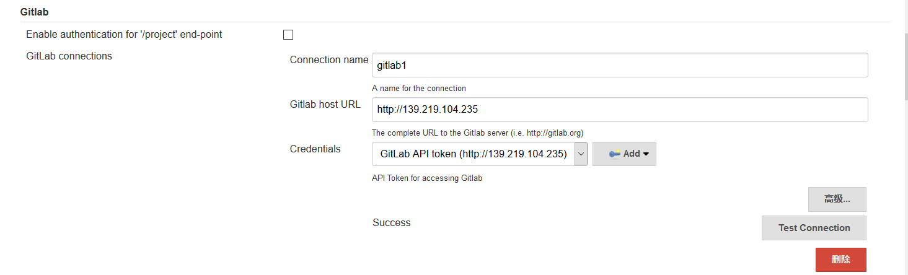
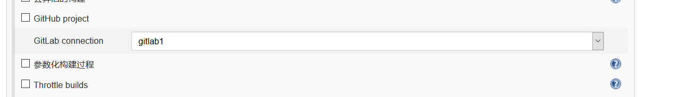
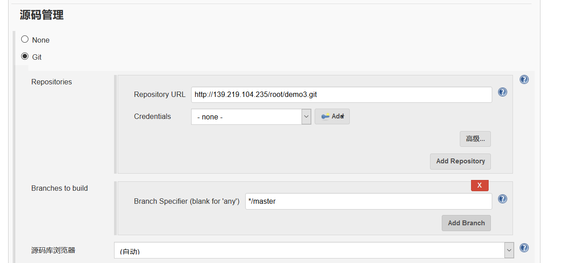
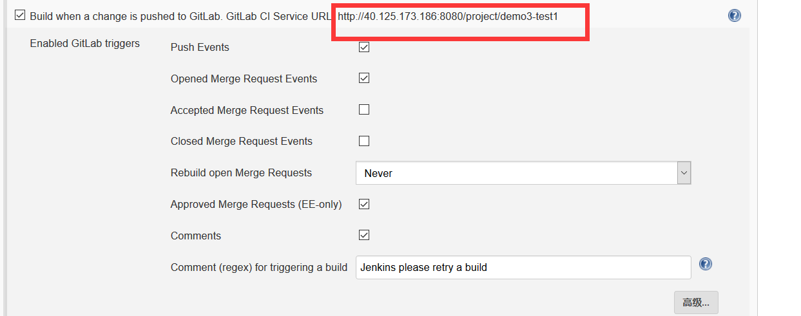
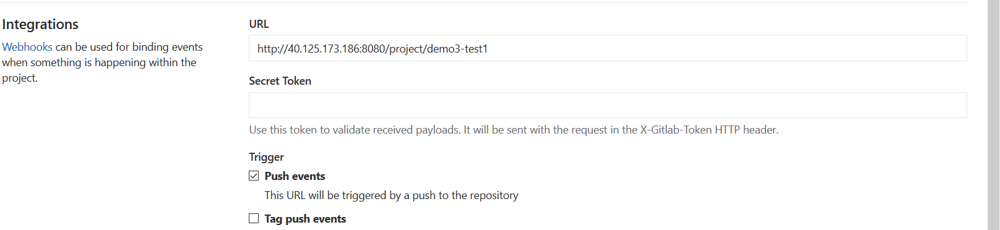
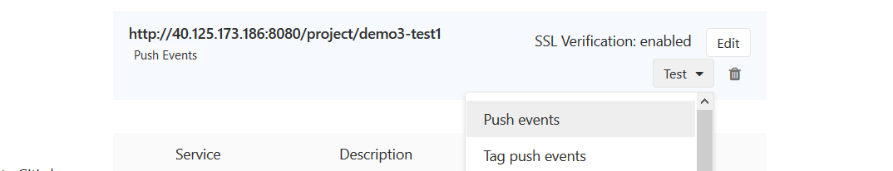

# Jenkins使用gitlab触发器 #
### 1. Install plugins ###
在Jenkins中搜索gitlab插件并安装。
### 2. Jenkins Settings ###
>进入jenkins的系统设置，找到“Gitlab”，填写gitlab相关信息。  
+ gitlab的Credentials是使用api token。这个token的获取方法如下：  
    >进入gitlab的页面，点击右上角选择Settings->Access token里获取。
+ 把“Enable authentication for '/project' end-point”的checkbox取消选择。
  

>新建Maven工程，选择好gitlab connection和源码管理，设置Gitalab的触发器
>选择好gitlab connection
>  
>设置源码管理 
>   
>触发器设置
> 

### 3. Gitlab设置 ###
>在Gitlab对应的repository下，选择侧边栏的Settings->Integrations,输入上图红框中的URL，Push events的checkbox打勾，并保存。
   
>可以对webhook进行测试。
 

经过上面的步骤，一个gitlab触发器就构建好了，当gitlab有push event时，将触发jenkins的build。