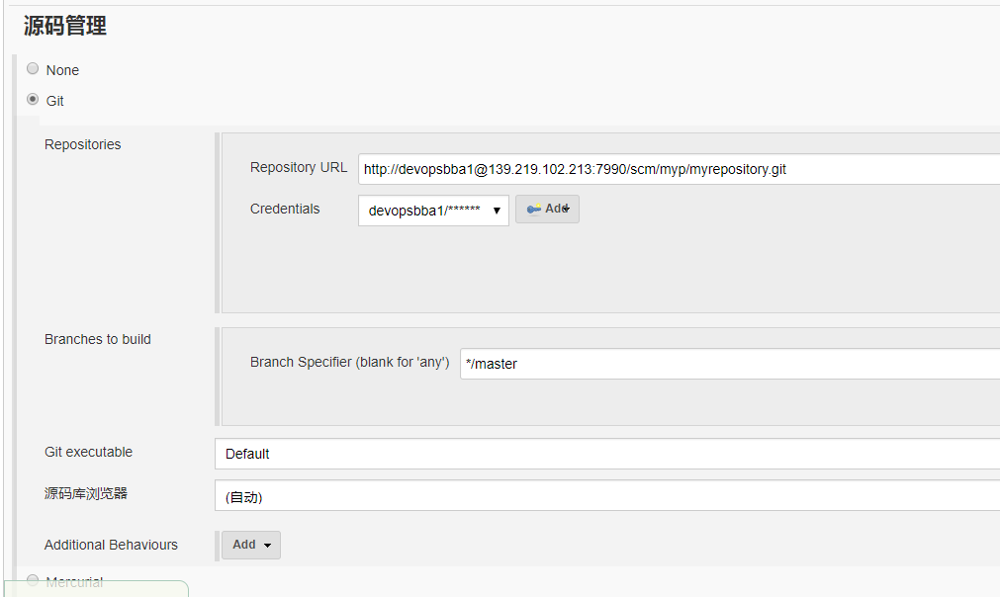
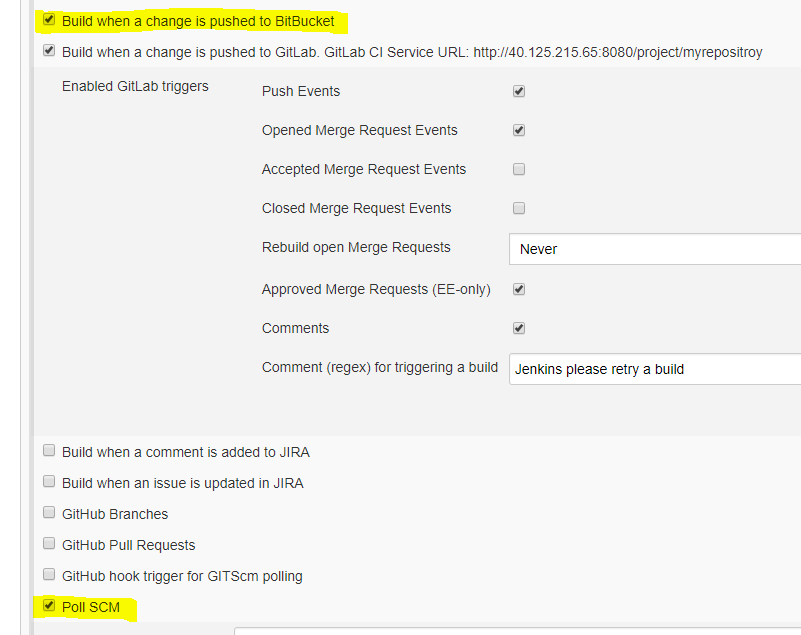
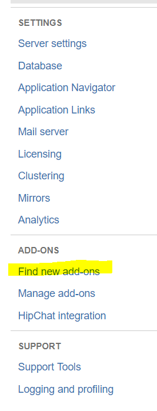
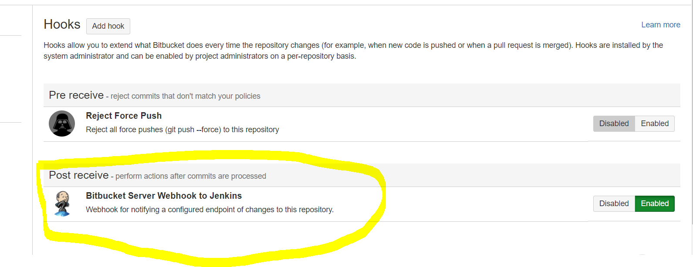
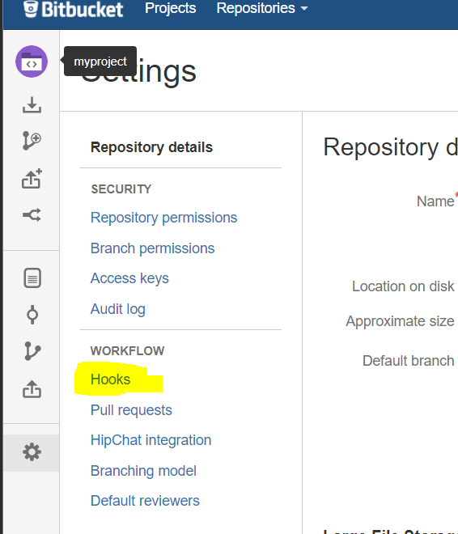
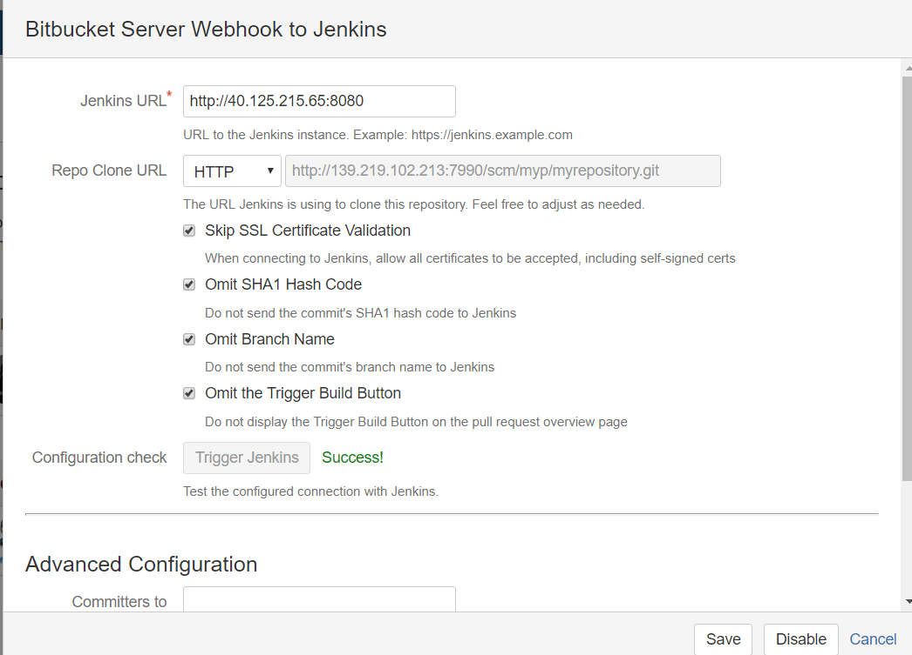

# jenkins 集成 bitbucket #
### 一.在jenkins安装bitbucket插件 ###

### 二.选择git ###

URL为bitbucket的仓库路径，Cresentials为bitbucket的用户名和密码  
这个部分可能会出现jenkins连接不上bitbucket仓库，重新登录bitbucket就可以了

### 三.勾选项配置如下：  ###

### 四.在bitbucket下面下载插件   ###
找到下图黄色部分，点击   

下载插件            

再到仓库的配置，       

最终的配置如下           
